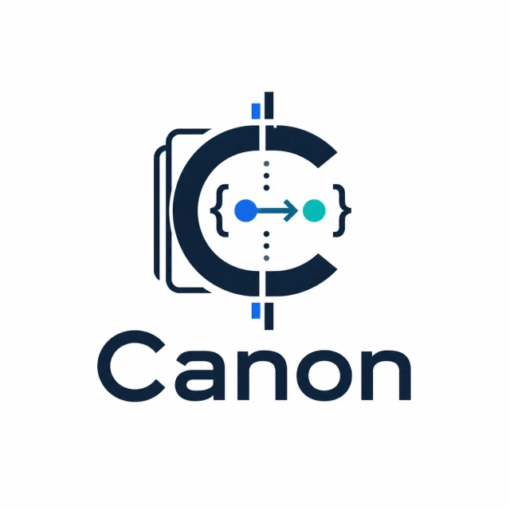
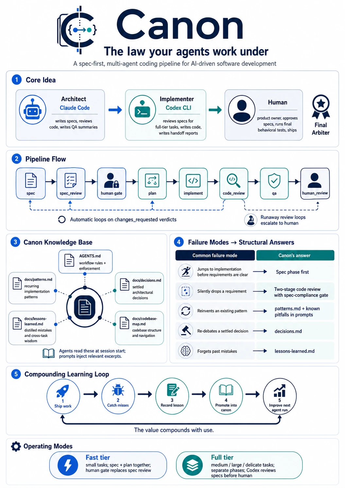

# Canon



> **The law your agents work under.**
>
> A spec-first, multi-agent coding pipeline you drop into any repo.

---

## What this is

Canon is an opinionated workflow framework for AI-driven software development. It encodes a hard-won discipline — accumulated over many shipped features and many post-mortems — into scripts, templates, and rules that two AI agents (an architect and an implementer) operate under, with a human as the final arbiter.

The goal: make AI coding agents reliably ship correct, on-spec, well-reviewed work without constant babysitting. Not "the agents do everything" — **the agents do the right thing, and the human catches what they miss, and over time the rules absorb every miss so the next miss never happens**.



That accumulation is the canon. The rules in `AGENTS.md`, the patterns in `docs/patterns.md`, the decisions in `docs/decisions.md` — they're not documentation, they're *enforcement*. Agents read them at session start. The pipeline injects relevant excerpts into prompts. Spec authorship and code review check against them. When a rule is violated and a bug ships, the lesson goes into `docs/lessons-learned.md` and eventually gets promoted into the canon, so the next agent can't make the same mistake.

## Why it exists

LLMs are extraordinary at writing code. They're mediocre at:

- **Knowing when to ask vs. assume**
- **Holding the full context of a project's conventions in their head over a long session**
- **Catching their own scope creep, dropped requirements, or silent regressions**
- **Distinguishing settled architectural decisions from open questions**

Canon is what happens when you treat those failure modes as engineering problems instead of "well, AI is what it is" shrugs. Each one gets a structural answer:

| Failure mode | Canon's answer |
|---|---|
| Agent jumps to implementation before requirements are clear | **Spec phase** before code, written conversationally with grilling for non-trivial tasks |
| Agent silently drops a requirement | **Two-stage code review** — Stage 1 is a spec-compliance gate that fails the whole review if any AC is missing from the cross-reference table |
| Agent reinvents an existing pattern | **`docs/patterns.md` trigger table** + Known Pitfalls injected into implement prompts |
| Agent re-debates a settled decision | **`docs/decisions.md`** — agents read, don't re-propose |
| Agent forgets a past mistake | **`docs/lessons-learned.md`** — distilled cross-task wisdom that promotes into permanent rules over time |
| Reviews loop forever on the same disagreement | **Auto-block on runaway review loops** — per-size caps (see `pipeline-policy.ts`), escalation to human after the cap |
| Spec drift between conversation and pipeline | **File-based handoff protocol** — every artifact lives in `tasks/<id>/`, no copy-pasting |
| Sensitive surfaces (auth, payments) get refactored on theoretical grounds | **`delicate: true` flag** that promotes the task to highest-effort tier and triggers extra review discipline |

## How it works

Canon orchestrates two AI coding CLIs:

- **Claude Code** (Anthropic) plays the **architect**: writes specs, reviews code, writes QA summaries.
- **Codex CLI** (OpenAI) plays the **implementer**: reviews specs (full-tier tasks), writes code, writes handoff reports.

A **human** is the product owner: approves specs, runs final behavioral tests, ships.

The orchestrator drives this. For each task:

```
spec → spec_review → human gate → plan → implement → code_review → qa → human_review
```

…with automatic loops on `changes_requested` verdicts, model/effort scaling by task size, optional git-worktree isolation, session resumption across phases, and auto-block on runaway loops. See `docs/pipeline-orchestrator.md` for the full mechanics.

The pipeline supports two tiers:

- **Fast tier** (small tasks): spec + plan in one Claude session, skip Codex spec review, human gate replaces it.
- **Full tier** (medium / large / delicate tasks): every phase runs separately, Codex reviews specs before they reach the human.

A single command runs a task end-to-end:

```bash
canon run <task-id>
```

`--step --expect <phase>` runs one phase with a phase-mismatch guard. `--pr` pushes and opens a draft PR at `human_review`. `--ship` archives a finished task. Multiple task IDs in one invocation = bundle mode.

## Getting started

### Prerequisites

- **Node 24+**
- **git**
- **Claude Code** — `npm install -g @anthropic-ai/claude-code`
- **Codex CLI** — `npm install -g @openai/codex`
- **gh** (optional, for `--pr` / `--push`) — `brew install gh && gh auth login`

### Install

```bash
npm install -g --install-links github:tstraub89/canon-ai
```

> `--install-links` is required because npm otherwise symlinks the global install to its git cache rather than copying the committed `dist/`, which leaves the `canon` bin pointing at a transient path and command-not-found after the install reports success. The flag packs+installs as a regular dependency, which is what you want for a stable global CLI.

### Set up in a repo

```bash
cd your-project

# Install canon into this repo
canon init
```

`canon init` installs a Claude Code skill (`/canon-init`) in your project. Open Claude Code in your project directory and run `/canon-init` to start the interactive setup. The skill grills Claude on your codebase — one question at a time, with recommended answers — and generates the full canon document set: `AGENTS.md`, `CLAUDE.md`, `CODEX.md`, and the `docs/` knowledge corpus tailored to your project.

After setup:

```bash
# Create your first task (Claude writes the spec conversationally)
canon task new my-first-feature "Short description"

# Run the pipeline
canon run my-first-feature
```

### Skip the permission prompts (optional)

Canon drives a lot of `git`, `gh`, `codex`, and `npm` invocations. To avoid a Claude Code permission prompt on every step, drop these into `.claude/settings.json` under `permissions.allow`:

```json
{
  "permissions": {
    "allow": [
      "Bash(git *)",
      "Bash(gh *)",
      "Bash(jq *)",
      "Bash(sed *)",
      "Bash(awk *)",
      "Bash(ls *)",
      "Bash(find *)",
      "Bash(npm run *)",
      "Bash(npx canon *)",
      "Bash(canon *)",
      "Bash(npx tsx *)",
      "Bash(codex *)",
      "Skill(canon-init)",
      "Skill(canon-spec)",
      "Skill(canon-spec:*)",
      "Skill(canon-pipeline)",
      "Skill(canon-pipeline:*)",
      "Skill(canon-status)",
      "Skill(canon-status:*)",
      "Skill(canon-changelog)",
      "Skill(canon-changelog:*)"
    ]
  }
}
```

Claude Code creates `settings.json` on first use — check what's already there before pasting. For a personal "full send" allowlist that doesn't get committed, use `.claude/settings.local.json` (and make sure it's gitignored — `canon doctor` will warn you if it isn't).

### Key commands

| Command | What it does |
|---|---|
| `canon init` | Install canon into the current repo |
| `canon doctor` | Verify environment and canon setup |
| `canon task new <id> "Title"` | Scaffold a new task from templates |
| `canon task list` | Show all tasks and their pipeline phase |
| `canon task phase <id> <phase> <status>` | Advance a task phase manually |
| `canon run <id>` | Run the full pipeline for a task |
| `canon run <id> --step` | Run one phase then stop |
| `canon run <id> --pr` | Push branch and open a draft PR |
| `canon upgrade` | Sync vendored files to match installed version |
| `canon update` | Update the canon-ai package itself |

Full `canon task` subcommand reference is in `docs/pipeline-orchestrator.md`.

### Customizing task templates

Task templates live in `.canon/templates/` and are managed by canon — `canon upgrade` overwrites them. To customize a template for your project, copy it to `tasks/_templates/`:

```bash
cp .canon/templates/spec.md tasks/_templates/spec.md
# edit tasks/_templates/spec.md — add your validation commands, project-specific sections, etc.
```

`canon task new` checks `tasks/_templates/` first and falls back to `.canon/templates/`. Files in `tasks/_templates/` are never touched by `canon upgrade`.

After upgrading, check whether structural changes landed in the canonical template that you should incorporate into your override:

```bash
diff .canon/templates/spec.md tasks/_templates/spec.md
```

See `.canon/README.md` for a quick reference.

## Architecture: two layers

Canon is two products:

### Layer 1: The Scaffold

The portable structure: orchestration scripts, task templates, agent rules (`AGENTS.md` / `CLAUDE.md` / `CODEX.md`), knowledge corpus templates (`docs/patterns.md`, `docs/decisions.md`, etc.), config files for both CLIs.

Drop this into any repo and you have:

- A working multi-agent pipeline that runs spec → review → implement → review → QA without intervention
- Templates for every artifact the pipeline produces
- The discipline (low-padding communication norms, two-stage code review, code-is-canonical, etc.) baked into the agent rules
- A knowledge corpus structure (`docs/patterns.md`, `docs/decisions.md`, `docs/codebase-map.md`) you fill in as your project's conventions emerge

### Layer 2: The Bootstrap CLI

`canon init` + `/canon-init` — installed as a Claude Code skill in your project. Grills Claude on your codebase and generates the initial knowledge corpus: codebase map, decisions surfaced from your existing conventions, patterns you're already using. The goal: collapse the "fill in your canon as you go" cold start into a single onboarding session.

## Current scope

✅ **Built and working:**

- `canon` CLI — `init`, `doctor`, `run`, `task`, `update`, `upgrade`
- Full pipeline orchestrator with phase routing, worktree isolation, session resumption, auto-block, bundle mode, `--reroute`, `--ship`. Bundled into `dist/scripts/run-task.js` and invoked via `canon run`.
- Pure routing policy module (tier/sizing/model/effort matrix), table-tested.
- `canon task` lifecycle CLI (new / list / status / phase / reset-spec-review / post-merge-sync / release-init), in-process TS.
- `.canon/templates/` — artifact templates (status, spec, spec-review, plan, handoff, review, done, notes)
- `AGENTS.md` / `CLAUDE.md` / `CODEX.md` — workflow rules and per-agent guidance
- `docs/` — knowledge corpus templates with detailed scaffolding
- `.codex/config.toml` / `.claude/settings.json` — agent CLI configs
- `/canon-init` skill — interactive grill that generates the full knowledge corpus for a new project
- Unit-test suite covering the policy module, orchestrator extractors, and validation parsers (`npm test`)

🚧 **Stubbed with `TODO[canon]:` markers — fill in for your project:**

- Validation matrix in `AGENTS.md` (which checks apply to which change types)
- Implementation Rules sections in `AGENTS.md` (state, styling, perf, testing, gating, assets, analytics — project-specific)
- All `docs/*.md` content (the templates teach you the format; the substance is yours — partially generated by `/canon-init`)

❌ **Not in scope for MVP:**

- Adapters for other agentic CLIs (Gemini CLI, Aider, etc.) — assumed Claude Code + Codex CLI
- Pre-built docs-check / external-API-citation tooling (project-specific)
- Per-language project bootstrappers (Python / Rust / Go variants)

## Supported platforms

- **macOS** and **Linux** are the supported targets. Canon's worktree helpers shell out to `git` for `worktree add`/`remove` and `worktree list --porcelain` parsing.
- **Windows is not supported.** Use WSL2.
- **Node**: 24.x.

## The canon philosophy

The metaphor matters. A *canon* is a body of accumulated, authoritative work — the texts that define a tradition. It accrues over time. New work is judged against it. Once something is canonical, you don't re-debate it.

That's exactly what `docs/patterns.md`, `docs/decisions.md`, and `AGENTS.md` are. They start small. They grow as the project ships features and absorbs lessons. They become more authoritative over time. And the more authoritative they are, the better the agents perform — because the agents stop having to guess.

The implication: **the value of canon compounds with use**. A 6-month-old canon repo on a real project is dramatically more useful than a fresh canon repo on a fresh project.

## Roadmap

**Phase 1 (now)**: Layer 1 + Layer 2 ship. npm package `canon-ai` with full CLI. `/canon-init` skill for interactive project bootstrap. Validate against real projects.

**Phase 2 (next)**: Make the implementer slot pluggable — adapter interface for Codex CLI, Gemini CLI, Aider, others. Architect slot stays Claude Code (skills are load-bearing).

**Phase 3 (research)**: Productize. Hosted bootstrap service? Per-language scaffolds? Marketplace for `docs/patterns.md` starter packs (Next.js patterns, Rails patterns, etc.)? TBD based on Phase 1 validation.

## License

Proprietary. See `LICENSE`. This may eventually open-source — that decision lives downstream of Phase 1 validation.

## Origin

Canon is the result of pulling the multi-agent pipeline out of [GalleryPlanner](https://gallery-planner.com), where it was developed and refined over several months of shipping features. The discipline encoded here was earned the hard way — every rule corresponds to a bug that shipped because the rule wasn't there yet.

That's the asset. The scripts are easy. The accumulated discipline is the moat.
